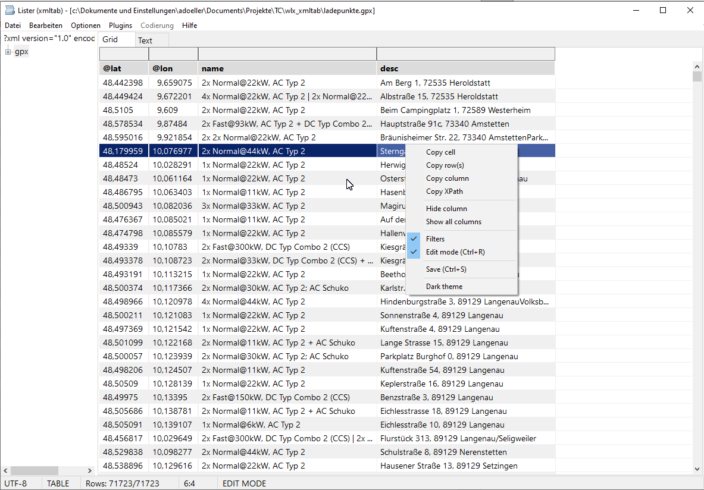

# xmltab-wlx Extended



A native Win32/Win64 Total Commander WLX plugin for viewing and editing XML
files in a combined tree, virtual table, and formatted text view.

## Highlights

xmltab turns Total Commander's Lister into a fast XML workbench: browse the
document tree, inspect repeated structures as a table, jump into a formatted
source view, and edit values without losing the original file style.

- See XML as structure and data at the same time: synchronized tree, virtual
  grid, and formatted text view.
- Work comfortably with big files: owner-data grid, sampled column sizing,
  lazy unfolding for huge roots, and incremental syntax highlighting while
  scrolling.
- Make table data readable: natural Unicode sorting, three-click original
  order restore, powerful column filters, Flat View for repeated XML records,
  and pixel-accurate decimal alignment even with proportional fonts.
- Edit with confidence: inline editing for attributes, text, comments, CDATA,
  processing instructions, and simple element text; insert blank structural
  row copies; delete rows or columns in edit mode.
- Save carefully: edits patch only the affected source range, then `Ctrl+S`
  writes atomically after reparsing the temporary file, preserving UTF-8,
  UTF-16LE, UTF-16BE, ANSI, and BOM where possible.
- Navigate without friction: continued `F3` search, source-accurate Locate
  from formatted text back to the tree, XPath copying, persistent splitter,
  remembered startup tab, zoom, themes, alternating rows, and configurable
  selection colors.
- Feel native in Total Commander: Win32 and Win64 WLX builds, GPX detection
  by default, context menus, and host hotkey forwarding where it belongs.

## Installation

1. Copy `xmltab.wlx` and `xmltab.wlx64` to the desired plugin directory.
2. In Total Commander, open **Configuration > Options > Plugins > Lister
   plugins**.
3. Add `xmltab.wlx`.
4. Restart Total Commander after replacing an already loaded plugin binary.

## Main Controls

| Control | Action |
|---|---|
| `Ctrl+E`, `Ctrl+R` | Toggle edit mode |
| `F2` | Edit the current grid cell |
| `Enter` | Accept an inline edit |
| `Escape` | Cancel an edit, leave a filter field, or close Lister through Total Commander |
| `Ctrl+S` | Atomically save changes |
| `F3` | Find the next occurrence |
| `Ctrl+L` | Locate the text-view position in the XML tree |
| `Ctrl+C` | Copy the current cell, selected rows' current column when `copy-column=1`, or XPath when the tree has focus |
| `Ctrl+Shift+C` | Copy selected rows using the configured `column-delimiter` |
| `Ctrl+Mouse wheel` | Zoom |
| Column-header click | Natural sort: ascending, descending, original order |
| Drag splitter | Resize the XML tree and grid areas |

The context menus expose editing, saving, filtering, formatting, Locate,
XPath copying, column visibility, and theme actions.

## Text View

Formatted mode automatically indents XML without changing the source file.
Mixed text content remains inline. The displayed text keeps a position map to
the original source, so Locate and loss-minimizing saving continue to operate
on the unformatted source.

Syntax colors are configurable for tags, attribute strings, values, CDATA,
and comments. Large documents are highlighted by visible viewport while
scrolling, avoiding the former fixed-size highlighting cutoff. Generated
indentation and RichEdit line-break positions are included in the display
map, preventing cumulative color and Locate offsets.

## Editing And Saving

Only typed, structurally safe cells are editable. Complex structure cells
remain read-only. Edits update only the affected grid cell without rebuilding
the table. `Enter` edits the selected grid cell like a double-click. In edit
mode, the grid context menu can insert a blank structural copy below the
selected element row, delete the selected row, or delete the current column
after confirmation. Flat columns delete the matching per-row XML nodes,
including keyed `k`/`v` tag elements. The temporary editor's former area is
explicitly repainted after closing.

Edits update the DOM and minimally patch the original XML source. Saving:

- writes a temporary file in the target directory;
- flushes and reparses the temporary file;
- atomically replaces the destination;
- preserves UTF-8, UTF-16LE, UTF-16BE, or ANSI source encoding and BOM;
- rejects ANSI saves when a changed value cannot be represented losslessly in
  the active Windows code page.

## Configuration

Settings are stored in the `[xmltab]` section of `xmltab.ini`. They include
the splitter position, font size, filter visibility, text formatting, light
and dark theme colors, syntax colors, grid colors, and column sampling limits.
When `xmltab.ini` exists beside the plugin, it takes precedence over the
default INI path supplied by Total Commander. Without a plugin-local INI,
xmltab reads and writes the Total Commander supplied INI.

Numeric settings accept surrounding whitespace and trailing semicolon
comments, for example:

```ini
xml-tag-color-dark = 16711680 ; RGB(0, 0, 255)
```

Color values use Windows `COLORREF` decimal integers. Every color has separate
light and dark variants:

| Area | Light setting | Dark setting |
|---|---|---|
| Grid text | `text-color` | `text-color-dark` |
| Alternating grid rows | `back-color`, `back-color2` | `back-color-dark`, `back-color2-dark` |
| Splitter | `splitter-color` | `splitter-color-dark` |
| Grid header text/background | `header-text-color`, `header-back-color` | `header-text-color-dark`, `header-back-color-dark` |
| Filter text/background | `filter-text-color`, `filter-back-color` | `filter-text-color-dark`, `filter-back-color-dark` |
| Current cell | `current-cell-back-color` | `current-cell-back-color-dark` |
| Selection text/background | `selection-text-color`, `selection-back-color` | `selection-text-color-dark`, `selection-back-color-dark` |
| XML default text | `xml-text-color` | `xml-text-color-dark` |
| XML tags | `xml-tag-color` | `xml-tag-color-dark` |
| XML attribute strings | `xml-string-color` | `xml-string-color-dark` |
| XML text values | `xml-value-color` | `xml-value-color-dark` |
| XML CDATA | `xml-cdata-color` | `xml-cdata-color-dark` |
| XML comments | `xml-comment-color` | `xml-comment-color-dark` |

All shipped color keys are read at startup and reapplied when switching
themes. Tabs and the status bar retain their Windows system colors.

Behavior settings:

| Setting | Default | Behavior |
|---|---:|---|
| `copy-column` | `0` | `0`: `Ctrl+C` copies the current cell. `1`: copies the current column from selected rows. |
| `column-delimiter` | Tab | First configured character used between cells when copying rows. An empty value uses Tab. |
| `disable-grid-lines` | `0` | `0`: show grid lines. `1`: hide grid lines. Applied when opening a viewer. |
| `decimal-align` | `1` | Align numeric-only columns containing recognized comma/dot decimals or integers. Integers in mixed integer/float columns end at the decimal anchor; integer-only columns remain right-aligned. |
| `disable-np-keys` | `0` | Disable forwarding `N` and `P` to Total Commander when set to `1`. |
| `disable-num-keys` | `0` | Disable forwarding keys `1` through `8` and `Ctrl+0` through `Ctrl+9` column sorting when set to `1`. |
| `exit-by-q` | `0` | Forward `Q` to Total Commander when set to `1`. |
| `FlatViewLevel` | `0` | Flatten XML element levels in the grid. The status bar shows `Flat: n`; click it to switch between 0, 1, and 2. `*` marks an active flat view for the selected node. At the document root, up to two leading element children may differ from the repeated row element, e.g. GPX `metadata` before `wpt` or OSM `note`/`meta` before `node`. Empty child elements with attributes are shown as `child.@attribute`. |
| `filter-align` | `0` | Filter text alignment: `-1` left, `0` center, `1` right. |
| `filter-case-sensitive` | `0` | Use case-sensitive filtering when set to `1`. |
| `filter-row` | `1` | Show the filter row when set to `1`. |
| `max-unfold-size` | `5000000` | Automatically unfold the first element only when the XML file is smaller; `0` means unlimited. |
| `tab-no` | `0` | Startup tab and persisted active tab: `0` = Grid, `1` = Text. |

## Building

Open `xmltab.lpi` in Lazarus or build its release modes:

```powershell
lazbuild --build-mode="Release 64" xmltab.lpi
lazbuild --build-mode="Release 32" xmltab.lpi
```

Outputs:

- `xmltab.wlx64` for 64-bit Total Commander
- `xmltab.wlx` for 32-bit Total Commander

## Tests

The repository contains focused tests for:

- parse/serialize/parse behavior and XML edge cases;
- source mapping and Locate;
- typed cell editing plus row insertion, row deletion, and column deletion in edit mode;
- loss-minimizing atomic saving and encoding preservation;
- display indentation and source-position mapping;
- RichEdit-compatible multi-line syntax-color positioning;
- INI precedence, numeric inline comments, and theme color application;
- Unicode natural sorting and sampled column sizing;
- decimal recognition and real-WLX custom-draw regression coverage;
- debounced filtering plus WLX loading, tree/grid behavior, continued search, Locate, and
  artifact-free editing.

See [`tests/README.md`](tests/README.md) and
[`MIGRATIONSSTATUS.md`](MIGRATIONSSTATUS.md) for details.
